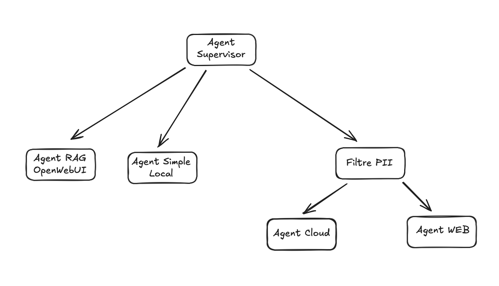
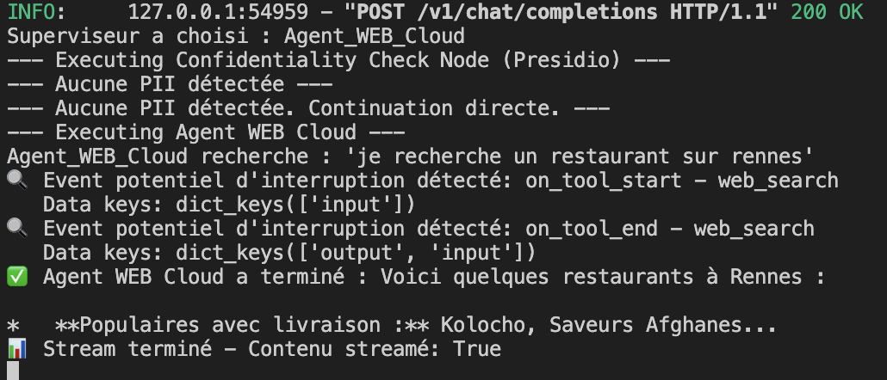
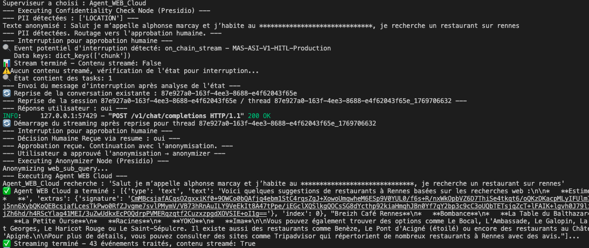
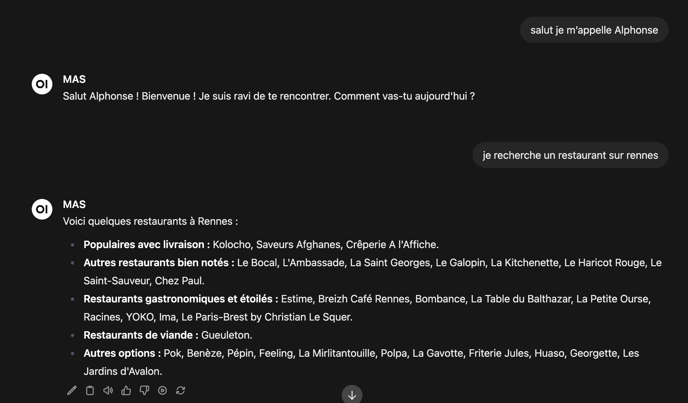
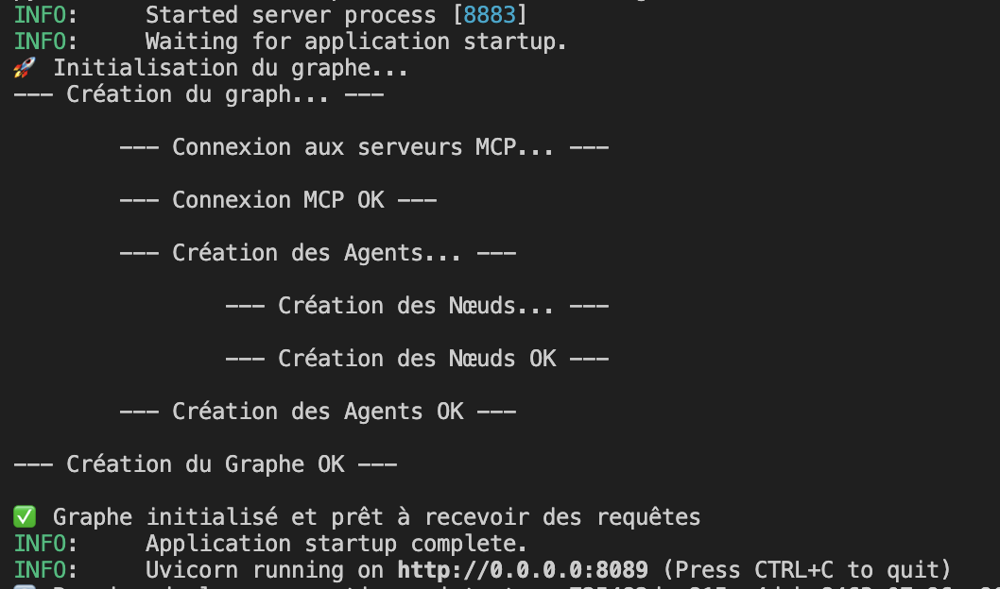
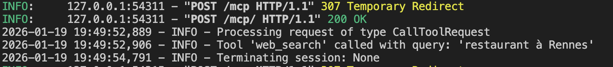

<p align="center">
  <h1 align="center">🤖 MAS - Multi-Agent System</h1>
  <p align="center">
    <strong>Système Multi-Agents Conversationnel Sécurisé avec Protection des Données Personnelles</strong>
  </p>
  <p align="center">
    
    
    
    
    
  </p>
</p>

---

MAS est un système multi-agents conversationnel avancé en français, conçu pour orchestrer intelligemment les interactions entre l'utilisateur et plusieurs agents spécialisés. Il intègre une gestion robuste de la confidentialité via la détection et l'anonymisation des données personnelles (PII) et propose une architecture hybride Local/Cloud.

## ✨ Fonctionnalités Clés

### 🎯 Architecture Multi-Agents
Orchestration intelligente par un superviseur qui route les requêtes vers l'agent le plus approprié selon le contexte et la complexité de la tâche.

### 🔒 Protection des Données (Privacy-First)
- **Détection automatique des PII** via Microsoft Presidio
- **Reconnaissance adaptée au contexte français** : NIR (numéro de sécurité sociale), téléphones, adresses, IBAN, passeports, etc.
- **Human-in-the-Loop (HITL)** : Demande d'approbation à l'utilisateur avant d'envoyer des données sensibles vers le Cloud
- **Anonymisation automatique** des données avant traitement externe

### 🧠 Support Multi-LLM
| Type | Modèle | Utilisation |
|------|--------|-------------|
| **Local** | Ollama (Llama 3.2) | Tâches simples, réponses rapides |
| **Superviseur** | Llama 3.2 fine-tuné (Unsloth) | Routing optimal des requêtes |
| **Cloud** | Google Gemini, Mistral, OpenAI | Tâches complexes, recherche web |

### 🤖 Agents Spécialisés
- 🌐 **Agent WEB Cloud** : Recherche web en temps réel via MCP & Google Serper
- 📄 **Agent RAG Document** : Analyse de documents contextuels (intégration OpenWebUI)
- 🧠 **Agent Simple Cloud** : Raisonnement complexe et tâches avancées
- ⚡ **Agent Simple Local** : Réponses rapides et privées (données non envoyées au cloud)

### 🔌 API Compatible OpenAI
Interface standard pour une intégration facile avec les frontends existants, avec support complet du streaming SSE.

---

## 🏗️ Architecture

Le système repose sur **LangGraph** pour l'orchestration des flux de conversation. Le superviseur analyse chaque requête et la route vers l'agent approprié, avec un filtre PII intermédiaire pour les agents Cloud.



**Flux de traitement :**
1. L'**Agent Supervisor** reçoit la requête utilisateur
2. Il analyse et route vers l'agent approprié :
   - **Agent RAG OpenWebUI** → Documents et contexte local
   - **Agent Simple Local** → Réponses rapides sans données sensibles
   - **Filtre PII** → Pour les agents Cloud (détection et anonymisation)
3. Le **Filtre PII** vérifie les données personnelles avant transmission
4. L'**Agent Cloud** ou **Agent WEB** traite la requête anonymisée

---

## 🔐 Système de Protection PII

### Cas 1 : Aucune PII détectée
Lorsque la requête ne contient pas de données personnelles, le système continue directement vers l'agent Cloud approprié.



### Cas 2 : PII détectée avec approbation Human-in-the-Loop
Lorsque des données personnelles sont détectées (nom, adresse, etc.), le système :
1. Interrompt le flux et demande l'approbation de l'utilisateur
2. Anonymise automatiquement les données après approbation
3. Continue le traitement avec les données masquées



**Données détectées dans cet exemple :**
- `LOCATION` : Adresse de l'utilisateur
- Texte anonymisé : `"Salut je m'appelle alphonse marcay et j'habite au **********************************, je recherche un restaurant sur rennes"`

---

## 🖥️ Interface Utilisateur

Le système s'intègre parfaitement avec **OpenWebUI** pour offrir une expérience conversationnelle fluide.



---

## 🚀 Démarrage Rapide

### Prérequis

- **Python** >= 3.13
- **uv** (gestionnaire de paquets Python rapide)
- **Ollama** installé localement avec le modèle `llama3.2:3b`
- Clés API pour les services Cloud

### Installation

```bash
# 1. Cloner le projet
git clone <votre-url-repo>
cd MAS

# 2. Installer les dépendances
uv sync

# 3. Télécharger le modèle spaCy (pour la détection PII)
uv run python -m spacy download fr_core_news_lg
```

### Configuration

Créez un fichier `.env` à la racine du projet :

```env
# LLM Providers
OPENAI_API_KEY=sk-...       # Pour le superviseur et le routage
GOOGLE_API_KEY=...          # Pour Gemini (Agents Cloud)
MISTRAL_API_KEY=...         # Optionnel

# Web Search
SERPER_API_KEY=...          # Pour la recherche Google via MCP

# Observabilité (Optionnel)
LANGSMITH_API_KEY=...
LANGFUSE_SECRET_KEY=...
LANGFUSE_PUBLIC_KEY=...
LANGFUSE_HOST=http://localhost:3001
```

---

## 🎮 Utilisation

### 1. Démarrer le Serveur API

```bash
uv run uvicorn src.app.api:app --host 0.0.0.0 --port 8089
```



Le serveur initialise automatiquement :
- Connexion aux serveurs MCP
- Création des agents spécialisés
- Construction du graphe LangGraph

### 2. Démarrer le Serveur MCP (Recherche Web)

Requis pour que l'**Agent WEB Cloud** fonctionne :

```bash
uv run python src/mcp_server/server_web.py
```



### 3. Configurer OpenWebUI (Frontend Recommandé)

```bash
# Démarrer OpenWebUI via Docker
docker run -d -p 3000:8080 \
  -v open-webui:/app/backend/data \
  --name open-webui \
  ghcr.io/open-webui/open-webui:main
```

**Configuration du pipeline :**
1. Accédez à l'interface d'administration OpenWebUI
2. Allez dans **Pipelines** (ou **Functions**)
3. Importez le contenu de `src/openwebui/pipeline.py`
4. Configurez l'URL de l'API :
   ```
   http://host.docker.internal:8089/v1/chat/completions
   ```

---

## 🧪 Tests

Le projet inclut une suite de tests complète :

```bash
# Tests rapides (unitaires + intégration)
./run_tests.sh

# Tous les tests (incluant les tests lents de reconnaissance PII)
./run_tests.sh --all

# Tests avec couverture de code
./run_tests.sh --coverage
```

---

## 📁 Structure du Projet

```
MAS/
├── src/
│   ├── app/              # Cœur de l'application
│   │   ├── api.py        # API FastAPI compatible OpenAI
│   │   └── graph.py      # Graphe LangGraph d'orchestration
│   ├── agent/            # Implémentation des agents
│   │   ├── supervisor.py # Agent superviseur (routing)
│   │   ├── web_agent.py  # Agent recherche web
│   │   ├── rag_agent.py  # Agent RAG documents
│   │   └── simple_agent.py
│   ├── presidio/         # Détection et anonymisation PII
│   │   ├── analyzer.py   # Analyseur de données personnelles
│   │   └── anonymizer.py # Anonymisation des PII
│   ├── mcp_server/       # Serveur Model Context Protocol
│   │   └── server_web.py # Outil de recherche web
│   └── openwebui/        # Intégration frontend
│       └── pipeline.py   # Pipeline OpenWebUI
├── tests/                # Tests automatisés
├── screen/               # Captures d'écran documentation
└── .env                  # Configuration (non versionné)
```

---

## 🛠️ Technologies Utilisées

| Catégorie | Technologies |
|-----------|--------------|
| **Orchestration** | LangGraph, LangChain |
| **LLMs** | Ollama, Google Gemini, Mistral, OpenAI |
| **Privacy** | Microsoft Presidio, spaCy |
| **API** | FastAPI, SSE Streaming |
| **Frontend** | OpenWebUI |
| **Outils** | MCP (Model Context Protocol), Google Serper |
| **Observabilité** | LangSmith, Langfuse |

---

## 📝 Roadmap

- [ ] Support de modèles locaux supplémentaires (Mistral, Phi)
- [ ] Interface web native sans dépendance à OpenWebUI
- [ ] Amélioration de la détection PII pour d'autres langues
- [ ] Système de cache pour les requêtes répétitives
- [ ] Dashboard de monitoring en temps réel

---

## 📄 Licence

Ce projet est sous licence MIT. Voir le fichier [LICENSE](LICENSE) pour plus de détails.

---

<p align="center">
  <em>Développé dans le cadre de recherches sur les systèmes multi-agents sécurisés.</em>
</p>