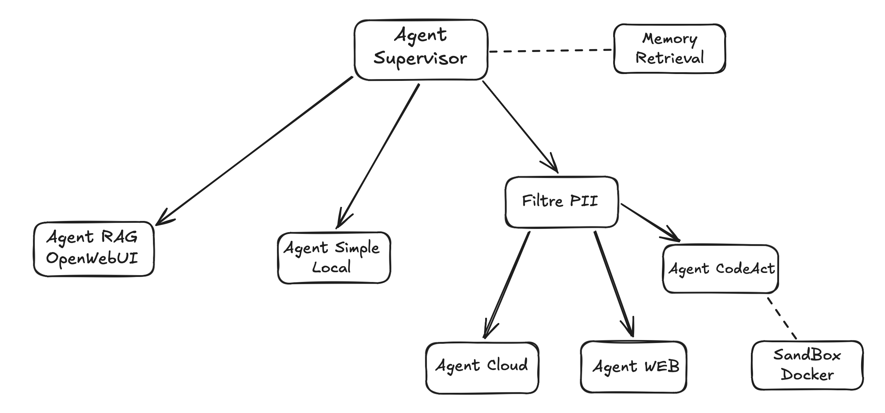
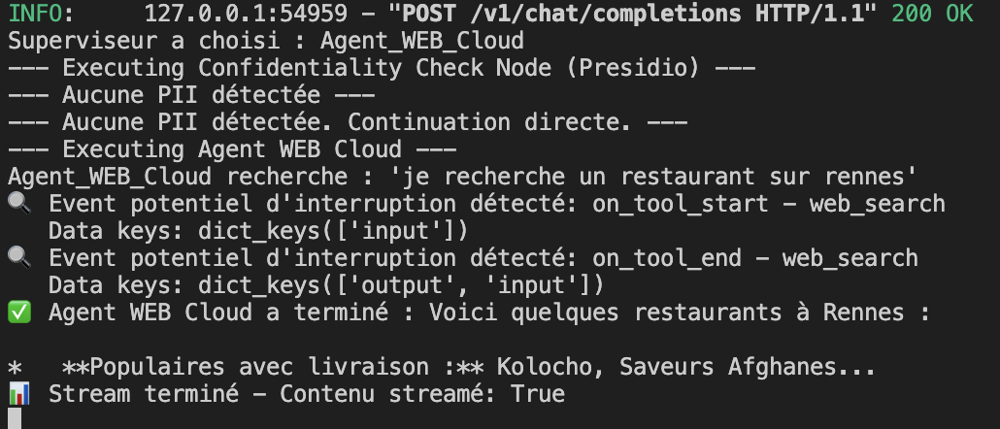
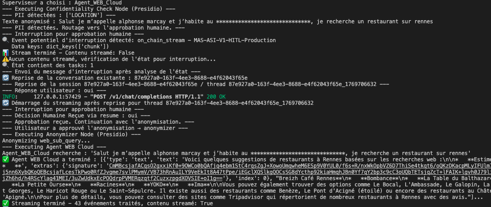
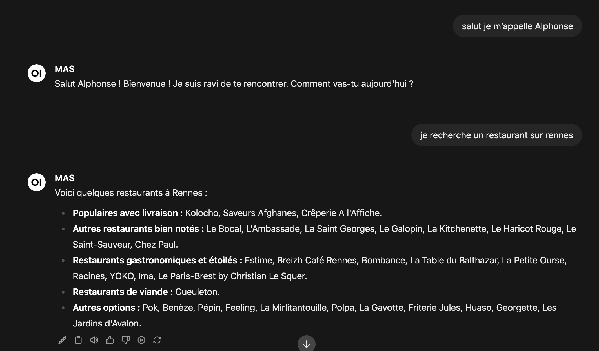
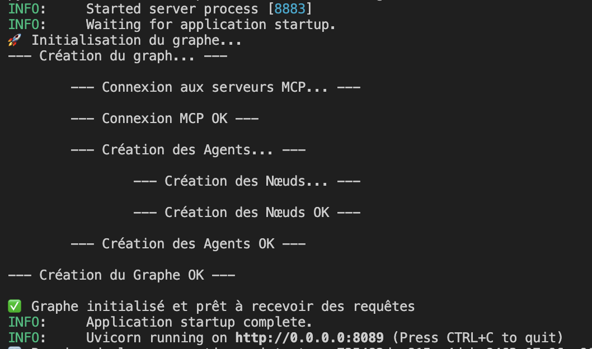
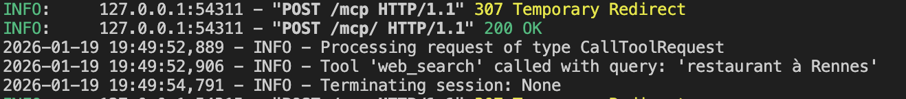

<p align="center">
  <h1 align="center">🤖 MAS - Multi-Agent System</h1>
  <p align="center">
    <strong>Système Multi-Agents Conversationnel Sécurisé avec Protection des Données Personnelles</strong>
  </p>
  <p align="center">
    
    
    
    
    
    
    
    
  </p>
</p>

---

MAS est un système multi-agents conversationnel avancé en français, conçu pour orchestrer intelligemment les interactions entre l'utilisateur et cinq agents spécialisés. Il intègre une gestion robuste de la confidentialité (détection et anonymisation PII), une mémoire persistante cross-sessions, et l'exécution sécurisée de code Python dans un sandbox Docker.

## ✨ Fonctionnalités Clés

### 🎯 Architecture Multi-Agents (5 agents)
Orchestration intelligente par un superviseur (LLM finetuner de llama3.2:3b via Unsloth) qui route chaque requête vers l'agent le plus adapté selon le contexte et la complexité.

### 🔒 Protection des Données (Privacy-First)
- **Détection automatique des PII** via Microsoft Presidio (11+ reconnaisseurs)
- **Reconnaissance adaptée au contexte français** : NIR, téléphones, adresses, IBAN, passeports, etc.
- **Human-in-the-Loop (HITL)** : approbation utilisateur requise avant envoi de données sensibles vers le Cloud
- **Anonymisation automatique** des données avant tout traitement externe

### 🧠 Mémoire Persistante Cross-Sessions
- Stockage sémantique des faits et préférences utilisateur avec **ChromaDB**
- Embeddings locaux via **sentence-transformers** (`all-MiniLM-L6-v2`)
- Extraction automatique des faits et résumés par LLM après chaque échange
- Injection du contexte mémorisé dans les prompts des agents

### 💻 Exécution de Code (Agent CodeAct)
- Exécution sécurisée de Python dans un **sandbox Docker isolé**
- Capacités : calculs, traitement de données, visualisations, scripts
- Basé sur `langgraph-codeact` avec `Gemini 2.5 Flash`

### 🌐 Support Multi-LLM
| Type | Modèle | Utilisation |
|------|--------|-------------|
| **Superviseur** | Finetuner Llama 3.2:3b via Unsloth| Routing et orchestration |
| **Cloud** | Google Gemini 2.5 Flash | Agents Cloud et CodeAct |
| **Web** | OpenAI GPT-4.1 + MCP | Recherche web temps réel |
| **Local** | Ollama (Llama 3.2:3b) | Réponses rapides et privées |

### 🔌 API Compatible OpenAI
Interface standard `/v1/chat/completions` avec support complet du streaming SSE.

---

## 🏗️ Architecture

Le système repose sur **LangGraph** pour l'orchestration des flux. Chaque requête traverse un pipeline structuré avant d'atteindre l'agent final.



**Flux de traitement :**
1. **Memory Retrieval** → recherche sémantique dans ChromaDB
2. **Supervisor** → analyse et route vers l'agent approprié
3. **Confidentiality Check** → détection PII via Presidio
4. **Human Approval (HITL)** → si PII détectée, interruption et demande d'approbation
5. **Anonymization** → masquage des données sensibles si approuvé
6. **Agent Execution** → traitement par l'agent sélectionné
7. **Memory Extraction** → extraction de faits et résumé → stockage ChromaDB

---

## 🤖 Agents Spécialisés

| Agent | Modèle | Description |
|-------|--------|-------------|
| **Agent Simple Local** | Ollama Llama 3.2:3b | Réponses rapides, données non envoyées au cloud |
| **Agent Simple Cloud** | Gemini 2.5 Flash | Raisonnement complexe et tâches avancées |
| **Agent WEB Cloud** | GPT-4.1 + MCP | Recherche web en temps réel via Google Serper |
| **Agent RAG Document** | — | Analyse de documents contextuels (intégration OpenWebUI) |
| **Agent CodeAct Cloud** | Gemini 2.5 Flash | Exécution de code Python dans sandbox Docker |

---

## 🔐 Système de Protection PII

### Cas 1 : Aucune PII détectée
La requête passe directement vers l'agent Cloud approprié.



### Cas 2 : PII détectée avec approbation Human-in-the-Loop
1. Le flux s'interrompt et demande l'approbation de l'utilisateur
2. Les données sont anonymisées après approbation
3. Le traitement reprend avec les données masquées



**Reconnaisseurs PII français disponibles :**
NIR (sécurité sociale), numéros de téléphone, IBAN, adresses, passeports, noms, emails, et plus.

---

## 🖥️ Interface Utilisateur

Le système s'intègre avec **OpenWebUI** pour une expérience conversationnelle fluide.



---

## 🚀 Démarrage Rapide

### Prérequis

- **Python** >= 3.13
- **uv** (gestionnaire de paquets Python rapide)
- **Docker** (pour le sandbox CodeAct)
- **Ollama** avec le modèle `llama3.2:3b` pour l'agent local
- Clés API pour les services Cloud

### Installation

```bash
# 1. Cloner le projet
git clone <votre-url-repo>
cd MAS

# 2. Installer les dépendances
uv sync

# 3. Télécharger le modèle spaCy (détection PII)
uv run python -m spacy download fr_core_news_lg

# 4. Construire l'image Docker sandbox (agent CodeAct)
docker build -f Dockerfile.sandbox -t mas-sandbox .
```

### Configuration

Créez un fichier `.env` à la racine du projet :

```env
# LLM Providers
OPENAI_API_KEY=sk-...       # Superviseur et agent WEB
GOOGLE_API_KEY=...          # Gemini (agents Cloud et CodeAct)
MISTRAL_API_KEY=...         # Optionnel

# Web Search
SERPER_API_KEY=...          # Recherche Google via MCP

# Observabilité (Optionnel)
LANGSMITH_API_KEY=...
LANGFUSE_SECRET_KEY=...
LANGFUSE_PUBLIC_KEY=...
LANGFUSE_HOST=http://localhost:3001
```

---

## 🎮 Utilisation

### 1. Démarrer le Serveur API

```bash
uv run uvicorn src.app.api:app --host 0.0.0.0 --port 8089
```



Le serveur initialise automatiquement :
- Connexion aux serveurs MCP
- Chargement de la mémoire ChromaDB
- Création des agents spécialisés (dont CodeAct avec Docker)
- Construction du graphe LangGraph

### 2. Démarrer le Serveur MCP (Recherche Web)

Requis pour que l'**Agent WEB Cloud** fonctionne :

```bash
uv run python src/mcp_server/server_web.py
```



### 3. Configurer OpenWebUI (Frontend Recommandé)

```bash
docker run -d -p 3000:8080 \
  -v open-webui:/app/backend/data \
  --name open-webui \
  ghcr.io/open-webui/open-webui:main
```

**Configuration du pipeline :**
1. Accédez à l'interface d'administration OpenWebUI
2. Allez dans **Pipelines** (ou **Functions**)
3. Importez le contenu de `src/openwebui/pipeline.py`
4. Configurez l'URL de l'API :
   ```
   http://host.docker.internal:8089/v1/chat/completions
   ```

---

## 🧪 Tests

```bash
# Tests rapides (unitaires, défaut)
./run_tests.sh

# Tous les tests (incluant les tests lents PII avec spaCy)
./run_tests.sh --all --verbose

# Suites spécifiques
./run_tests.sh --api           # Tests API
./run_tests.sh --graph         # Tests du graphe
./run_tests.sh --recognizer    # Tests PII (nécessite spaCy)

# Test unitaire précis
uv run pytest tests/test_api.py::TestSanitizeMessageName::test_sanitize_simple_name -v

# Avec couverture de code
./run_tests.sh --coverage
```

**Marqueurs de tests :**
- `--run-slow` : tests PII nécessitant spaCy
- `--run-integration` : tests de flux complets

---

## 📁 Structure du Projet

```
MAS/
├── src/
│   ├── app/                      # Cœur de l'application
│   │   ├── api.py                # API FastAPI compatible OpenAI (SSE)
│   │   └── graph.py              # Graphe LangGraph d'orchestration
│   ├── agent/                    # Implémentation des agents
│   │   ├── agent_web.py          # Agent recherche web (MCP + GPT-4.1)
│   │   └── agent_codeact.py      # Agent CodeAct (Python + Docker)
│   ├── memory/                   # Mémoire persistante cross-sessions
│   │   ├── memory_manager.py     # ChromaDB + sentence-transformers
│   │   └── memory_extractor.py   # Extraction faits/résumés par LLM
│   ├── sandbox/                  # Exécution sécurisée de code
│   │   └── docker_executor.py    # Exécuteur Docker isolé
│   ├── presidio/                 # Détection et anonymisation PII
│   │   └── recognizer.py         # 11+ reconnaisseurs français
│   ├── mcp_server/               # Serveur Model Context Protocol
│   │   └── server_web.py         # Outil de recherche web (port 8003)
│   └── openwebui/                # Intégration frontend
│       └── pipeline.py           # Pipeline OpenWebUI
├── tests/                        # Suite de tests automatisés
│   ├── test_api.py
│   ├── test_graph.py
│   ├── test_recognizer.py
│   ├── test_memory.py
│   ├── test_codeact.py
│   └── test_sandbox_security.py
├── Dockerfile.sandbox            # Image Docker pour le sandbox CodeAct
├── data/memory_chroma/           # Base ChromaDB (générée, non versionnée)
├── screen/                       # Captures d'écran documentation
└── .env                          # Configuration (non versionné)
```

---

## 🛠️ Technologies Utilisées

| Catégorie | Technologies |
|-----------|--------------|
| **Orchestration** | LangGraph, LangChain |
| **LLMs** | Ollama, Google Gemini, OpenAI GPT-4.1, Unsloth |
| **Privacy** | Microsoft Presidio, spaCy (`fr_core_news_lg`) |
| **Mémoire** | ChromaDB, sentence-transformers (`all-MiniLM-L6-v2`) |
| **Code Execution** | Docker, langgraph-codeact |
| **API** | FastAPI, SSE Streaming |
| **Frontend** | OpenWebUI |
| **Outils** | MCP (Model Context Protocol), Google Serper |
| **Observabilité** | LangSmith, Langfuse |

---

## 📄 Licence

Ce projet est sous licence MIT. Voir le fichier [LICENSE](LICENSE) pour plus de détails.

---

<p align="center">
  <em>Développé dans le cadre de recherches sur les systèmes multi-agents sécurisés.</em>
</p>
